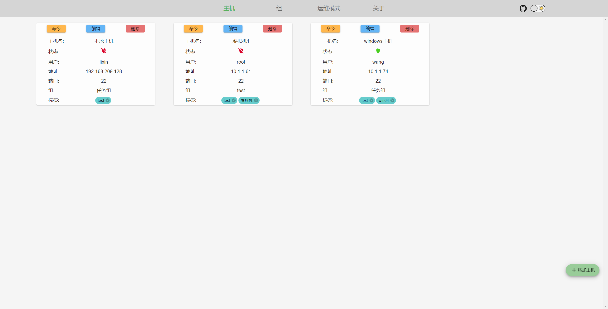
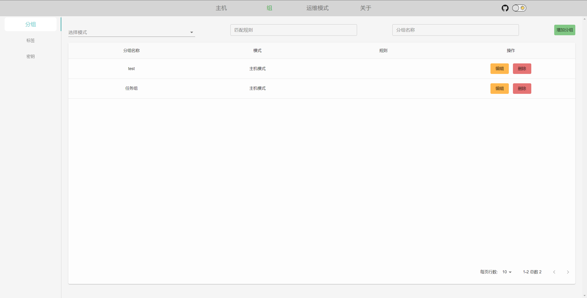
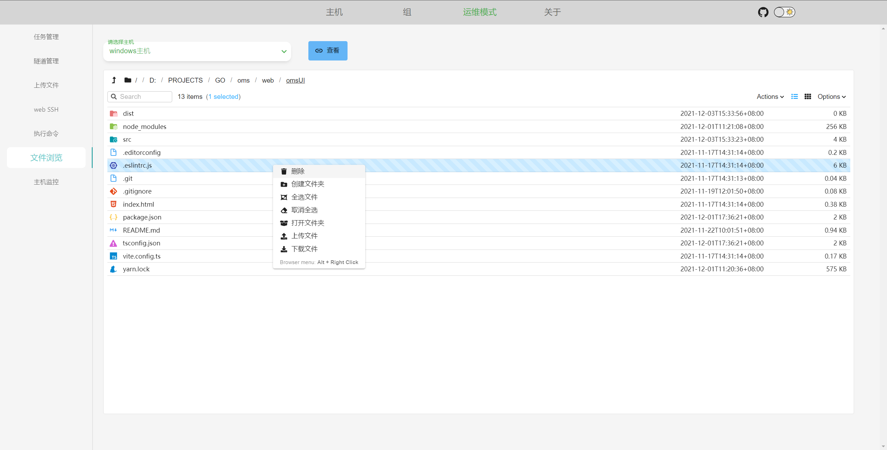
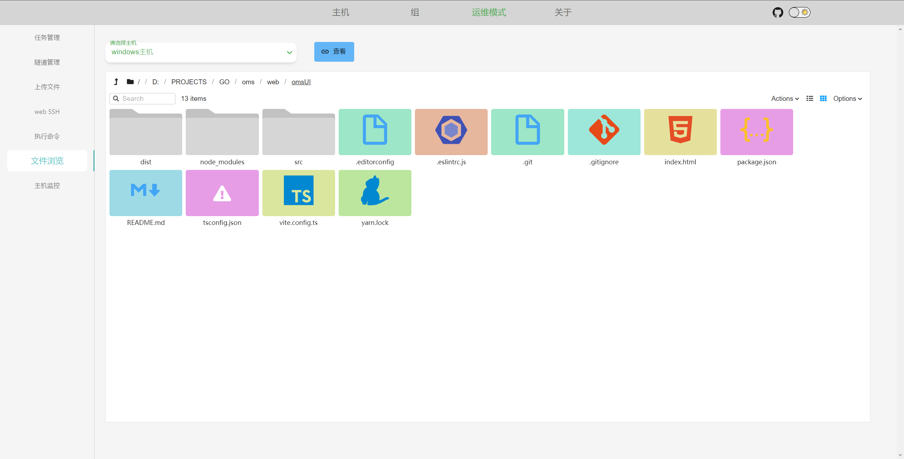
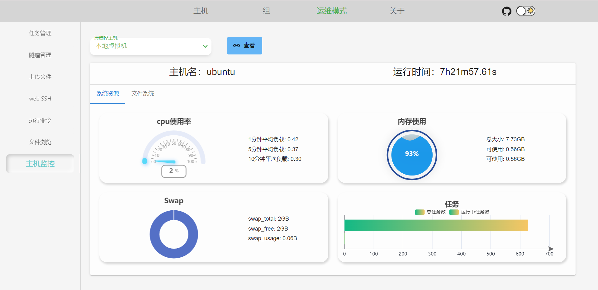
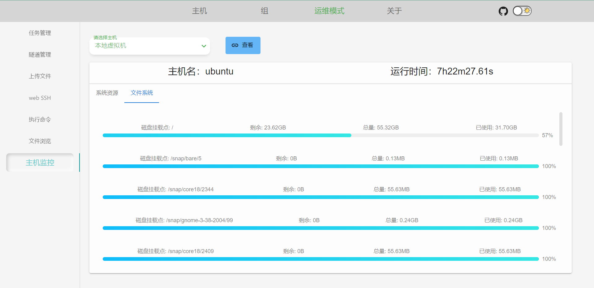

<h1 align="center">项目简介</h1>

<p align="center">
本项目后端使用gin、gorm和ssh、sftp开发。旨在编写一个轻量，易用，多平台的运维项目。
前端使用react、typescript、vite构建。
现阶段目的是做一个阉割版的xshell并简单的实现ansible或者saltstack的部分功能。
</p>

<p align="center">
    <a href="https://github.com/lixin59/omsUI/blob/master/LICENSE">
        
    </a>
    <a href="https://github.com/lixin59/omsUI">
        
    </a>
    <a href="https://github.com/lixin59/omsUI">
        
    </a>
    <a href="https://github.com/lixin59/omsUI">
        
    </a>
    
    <br />
    
    
    
    
    <br />
</p>
<p align="center">
  <a href="https://wang918562230.gitbook.io/ssbeattyoms-wen-dang/">文档</a>
  ·
  <a href="https://github.com/ssbeatty/oms/releases">下载</a>
  ·
  <a href="https://wang918562230.gitbook.io/ssbeattyoms-wen-dang/">开始使用</a>
</p>

### 目前已经实现的功能

1. 隧道, 类似`ssh`的`-L`和`-R`
2. cron 任务和长进程的管理
3. ssh 命令批量执行
4. 文件批量的上传 流式传输支持大文件
5. 基于`sftp`文件浏览器

### 查看后端代码请移步到 [oms](https://github.com/ssbeatty/oms)

### 技术交流

- QQ 群 720670808
- 

## 安装依赖

```shell
pnpm install
```

## 1.运行

```shell
pnpm dev
```

## 2.编译

```shell
pnpm build
```
本地打包调试
```shell
pnpm build:test  && pnpm serve
```

## 3.注意

## node 版本 20.11.0 , vite 版本 5.1.X

## 开发环境调试设置

系统打包会优先使用`.env`文件里面的环境变量。
如果没有`.env`文件会使用默认的 host.
如果需要在开发环境中调试 api,在根目录下添加`.env`文件，然后添加以下内容(ip 地址和端口根据后端接口来修改).

```text
 VITE_TEST_HOST='127.0.0.1:9090'
```

## 项目预览

### 主题切换


### 主机页面



### 分组管理



### 任务管理


### 上传文件


### web ssh


### 文件浏览




### 主机监控



